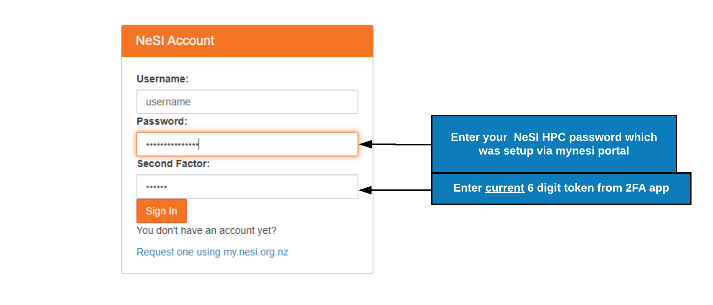
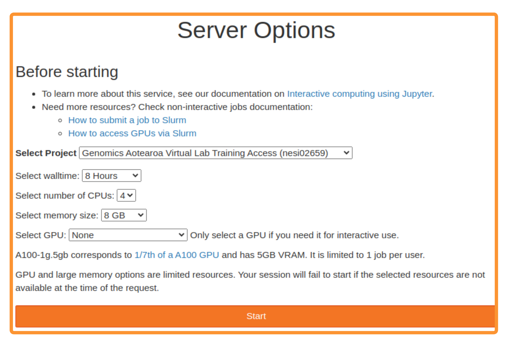

# <b>NeSI HPC Auth.Factors Setup & Jupyter Login</b>

??? key "1. Set HPC Password"

     **Done via** [https://my.nesi.org.nz/login](https://my.nesi.org.nz/login)
     
     {width="1200"}

??? key "2. Set HPC Second Factor"  

    **Done via** [https://my.nesi.org.nz/login](https://my.nesi.org.nz/login)

    {width="1000"}

??? jupyter "3. Jupyter Login Details"

    1. Follow [https://jupyter.nesi.org.nz/hub/login](https://jupyter.nesi.org.nz/hub/login)
    2. 
Enter NeSI username, HPC password and 6 digit second factor token 

    3. 
Choose server options as below
     >>make sure to choose the correct project code `nesi02659`, number of CPUs `CPUs=4`, memory `8 GB` prior to pressing {width="100"}button.
    
      

??? keybase "4. Reset HPC Password"

    **Done via** [https://my.nesi.org.nz/login](https://my.nesi.org.nz/login)
    
    {width="1000"}

??? keybase "5. ReSet HPC Second Factor" 

    **Done via** [https://my.nesi.org.nz/login](https://my.nesi.org.nz/login)

    {width="1000"}
